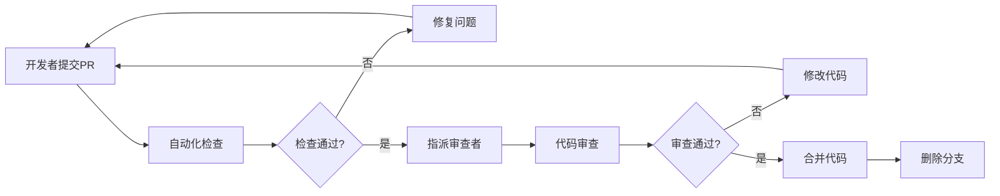
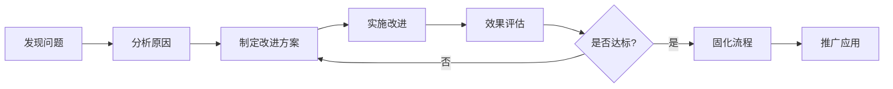

# 企业数字化解决方案项目规则

## 📋 规则概述

本文档规定了企业数字化解决方案项目的开发规范、工作流程、团队协作、质量标准等核心规则，确保项目高质量、高效率地推进。所有项目参与者必须严格遵守本规则。

### 🎯 规则原则
- **标准化**：统一的开发标准和工作流程
- **高质量**：严格的质量控制和代码审查
- **高效率**：精简的流程和自动化工具
- **可追溯**：完整的文档记录和版本管理
- **安全性**：全方位的安全保障措施

## 🔧 开发规范

### 💻 技术选型规范

#### 1. 前端技术栈规范
- **后台管理系统**
  - 框架：Vue 3.4+ (必须)
  - 语言：TypeScript 5.0+ (必须)
  - 构建：Vite 5.0+ (必须)
  - 组件库：Element Plus 2.4+ (必须)
  - 状态管理：Pinia 2.1+ (必须)

- **企业官网**
  - 基础：HTML5 + CSS3 + ES6+ (必须)
  - 辅助库：jQuery 3.6+ (可选)
  - 构建工具：Vite/Webpack (推荐)
  - 预处理器：Sass/Less (推荐)

#### 2. 开发工具规范
- **编辑器**：VSCode (推荐) / WebStorm (可选)
- **版本控制**：Git 2.34+ (必须)
- **包管理器**：pnpm 8.0+ (必须)
- **Node.js版本**：18.20.4+ (必须)

#### 3. 浏览器支持规范
```
支持浏览器版本要求：
- Chrome: 90+
- Firefox: 88+
- Safari: 14+
- Edge: 90+
- IE: 不支持
```

### 📝 代码规范

#### 1. 命名规范

##### 文件命名
```bash
# Vue组件文件 - PascalCase
UserProfile.vue
ProductList.vue
AdminLayout.vue

# TypeScript文件 - camelCase
userService.ts
dataUtils.ts
apiConfig.ts

# 样式文件 - kebab-case
main-layout.scss
user-profile.css
common-variables.scss

# 图片资源 - kebab-case
user-avatar.png
product-banner.jpg
icon-home.svg
```

##### 变量命名
```typescript
// 变量和函数 - camelCase
const userName = 'admin';
const getUserInfo = () => {};

// 常量 - UPPER_SNAKE_CASE
const API_BASE_URL = 'https://api.example.com';
const MAX_RETRY_COUNT = 3;

// 类名 - PascalCase
class UserService {}
class ApiManager {}

// 接口 - PascalCase, 以I开头
interface IUserInfo {}
interface IApiResponse {}

// 类型别名 - PascalCase
type UserRole = 'admin' | 'user';
type ApiStatus = 'loading' | 'success' | 'error';
```

#### 2. TypeScript 规范

```typescript
// 必须定义接口
interface UserInfo {
  id: number;
  name: string;
  email: string;
  role: UserRole;
  createdAt: Date;
}

// 函数必须定义参数和返回值类型
function fetchUserInfo(userId: number): Promise<UserInfo> {
  return api.get(`/users/${userId}`);
}

// 组件 Props 必须定义类型
interface UserCardProps {
  user: UserInfo;
  showActions?: boolean;
  onEdit?: (user: UserInfo) => void;
}

// 使用严格的类型检查
// tsconfig.json 必须配置
{
  "compilerOptions": {
    "strict": true,
    "noImplicitAny": true,
    "strictNullChecks": true
  }
}
```

#### 3. Vue 3 组件规范

```vue
<template>
  <!-- 使用语义化标签 -->
  <section class="user-profile">
    <header class="user-profile__header">
      <h1 class="user-profile__title">{{ title }}</h1>
    </header>
    
    <main class="user-profile__content">
      <!-- 内容区域 -->
    </main>
  </section>
</template>

<script setup lang="ts">
// 导入顺序：第三方库 -> 自定义模块 -> 类型定义
import { ref, computed, onMounted } from 'vue';
import { ElMessage } from 'element-plus';
import { userService } from '@/services/userService';
import type { UserInfo } from '@/types/user';

// Props 定义
interface Props {
  userId: number;
  editable?: boolean;
}

const props = withDefaults(defineProps<Props>(), {
  editable: false
});

// Emits 定义
interface Emits {
  update: [user: UserInfo];
  delete: [userId: number];
}

const emit = defineEmits<Emits>();

// 响应式数据
const userInfo = ref<UserInfo | null>(null);
const loading = ref(false);

// 计算属性
const displayName = computed(() => {
  return userInfo.value?.name || '未知用户';
});

// 方法定义
const fetchUserData = async (): Promise<void> => {
  try {
    loading.value = true;
    const response = await userService.getUserInfo(props.userId);
    userInfo.value = response.data;
  } catch (error) {
    ElMessage.error('获取用户信息失败');
  } finally {
    loading.value = false;
  }
};

// 生命周期
onMounted(() => {
  fetchUserData();
});
</script>

<style lang="scss" scoped>
.user-profile {
  // 使用BEM命名规范
  &__header {
    margin-bottom: 20px;
  }
  
  &__title {
    font-size: 24px;
    font-weight: 600;
    color: var(--text-color-primary);
  }
  
  &__content {
    padding: 20px;
    background: var(--bg-color-white);
    border-radius: 8px;
  }
}
</style>
```

#### 4. CSS/SCSS 规范

```scss
// 变量定义 - 使用语义化命名
:root {
  // 颜色变量
  --color-primary: #1976d2;
  --color-success: #67c23a;
  --color-warning: #e6a23c;
  --color-danger: #f56c6c;
  
  // 文字颜色
  --text-color-primary: #303133;
  --text-color-regular: #606266;
  --text-color-secondary: #909399;
  
  // 背景颜色
  --bg-color-white: #ffffff;
  --bg-color-light: #f5f7fa;
  
  // 间距变量
  --spacing-xs: 4px;
  --spacing-sm: 8px;
  --spacing-md: 16px;
  --spacing-lg: 24px;
  --spacing-xl: 32px;
}

// BEM命名规范
.user-list {
  // Block
  padding: var(--spacing-lg);
  
  &__header {
    // Element
    display: flex;
    justify-content: space-between;
    align-items: center;
    margin-bottom: var(--spacing-md);
  }
  
  &__item {
    // Element
    padding: var(--spacing-md);
    border: 1px solid #e0e0e0;
    border-radius: 4px;
    
    &--active {
      // Modifier
      border-color: var(--color-primary);
      background-color: rgba(25, 118, 210, 0.05);
    }
    
    &--disabled {
      // Modifier
      opacity: 0.6;
      pointer-events: none;
    }
  }
}

// 响应式设计
@mixin mobile {
  @media (max-width: 768px) {
    @content;
  }
}

@mixin tablet {
  @media (min-width: 769px) and (max-width: 1024px) {
    @content;
  }
}

@mixin desktop {
  @media (min-width: 1025px) {
    @content;
  }
}
```

### 📁 项目结构规范

#### 1. 后台管理系统结构
```
admin/
├── public/                     # 公共资源
├── src/
│   ├── api/                   # API接口
│   │   ├── modules/           # 分模块API
│   │   └── index.ts           # API统一导出
│   ├── assets/                # 静态资源
│   │   ├── images/            # 图片资源
│   │   ├── icons/             # 图标资源
│   │   └── styles/            # 全局样式
│   ├── components/            # 组件
│   │   ├── core/              # 核心组件
│   │   └── custom/            # 自定义组件
│   ├── composables/           # 组合式函数
│   ├── config/                # 配置文件
│   ├── directives/            # 自定义指令
│   ├── enums/                 # 枚举定义
│   ├── locales/              # 国际化
│   ├── mock/                  # Mock数据
│   ├── router/                # 路由配置
│   ├── store/                 # 状态管理
│   ├── types/                 # TypeScript类型
│   ├── utils/                 # 工具函数
│   ├── views/                 # 页面组件
│   ├── App.vue               # 根组件
│   └── main.ts               # 入口文件
├── tests/                     # 测试文件
├── docs/                      # 文档
└── package.json              # 项目配置
```

#### 2. 企业官网结构
```
web PC/
├── index.html                 # 首页
├── pages/                     # 页面文件
│   ├── about.html            # 关于我们
│   ├── products.html         # 产品中心
│   ├── news.html             # 新闻资讯
│   └── contact.html          # 联系我们
├── assets/                    # 静态资源
│   ├── css/                  # 样式文件
│   │   ├── Main File.css     # 主样式
│   │   ├── home page/        # 首页样式
│   │   ├── About Rongdian/   # 关于页面样式
│   │   ├── Contact us/       # 联系页面样式
│   │   └── product center/   # 产品页面样式
│   ├── js/                   # JavaScript文件
│   │   ├── Main File.js      # 主脚本
│   │   ├── home page/        # 首页脚本
│   │   ├── About Rongdian/   # 关于页面脚本
│   │   ├── Contact us/       # 联系页面脚本
│   │   └── product center/   # 产品页面脚本
│   └── images/               # 图片资源
│       ├── Main File/        # 公共图片
│       ├── home page/        # 首页图片
│       ├── About Rongdian/   # 关于页面图片
│       ├── Contact us/       # 联系页面图片
│       ├── product center/   # 产品页面图片
│       └── components/       # 组件图片
└── docs/                     # 文档说明
```

## 🔄 工作流程规范

### 📊 Git 工作流程

#### 1. 分支管理策略

```
分支类型及用途：
├── main              # 主分支，生产环境代码
├── develop           # 开发分支，集成测试代码
├── feature/*         # 功能分支，新功能开发
├── hotfix/*          # 热修复分支，紧急修复
├── release/*         # 发布分支，版本发布准备
└── bugfix/*          # 缺陷修复分支
```

#### 2. 分支命名规范

```bash
# 功能分支
feature/user-management
feature/product-catalog
feature/data-visualization

# 修复分支
hotfix/login-issue-fix
hotfix/performance-optimization
bugfix/table-pagination-error

# 发布分支
release/v1.0.0
release/v1.1.0
```

#### 3. 提交信息规范

```bash
# 提交类型
feat:     新功能
fix:      修复bug
docs:     文档更新
style:    代码格式调整（不影响功能）
refactor: 代码重构
perf:     性能优化
test:     测试相关
build:    构建相关
ci:       CI/CD相关
chore:    其他修改

# 提交格式
<type>(<scope>): <subject>

<body>

<footer>

# 示例
feat(user): 添加用户权限管理功能

- 实现角色分配功能
- 添加权限验证中间件
- 完善用户管理界面

Closes #123
```

#### 4. 代码审查流程



### 🚀 开发流程

#### 1. 功能开发流程

```bash
# 1. 从develop分支创建功能分支
git checkout develop
git pull origin develop
git checkout -b feature/new-feature

# 2. 开发功能
# ... 编写代码 ...

# 3. 提交代码
git add .
pnpm commit  # 使用规范化提交

# 4. 推送分支
git push origin feature/new-feature

# 5. 创建Pull Request
# 在Git平台创建PR，指定审查者

# 6. 代码审查和修改
# 根据审查意见修改代码

# 7. 合并到develop分支
# 审查通过后合并

# 8. 删除功能分支
git branch -d feature/new-feature
git push origin --delete feature/new-feature
```

#### 2. 发布流程

```bash
# 1. 创建发布分支
git checkout develop
git pull origin develop
git checkout -b release/v1.0.0

# 2. 版本号更新
# 更新package.json中的版本号
# 更新CHANGELOG.md

# 3. 发布测试
# 部署到测试环境进行测试

# 4. 修复发现的问题
# 在release分支上修复bug

# 5. 合并到main分支
git checkout main
git merge release/v1.0.0
git tag v1.0.0

# 6. 合并回develop分支
git checkout develop
git merge release/v1.0.0

# 7. 删除发布分支
git branch -d release/v1.0.0
```

### 🔍 质量控制流程

#### 1. 代码检查清单

- [ ] **语法检查**：ESLint检查通过
- [ ] **格式检查**：Prettier格式化完成
- [ ] **类型检查**：TypeScript类型检查通过
- [ ] **样式检查**：Stylelint检查通过
- [ ] **单元测试**：测试覆盖率 ≥ 80%
- [ ] **集成测试**：关键流程测试通过
- [ ] **性能测试**：页面加载时间 ≤ 2秒
- [ ] **安全检查**：安全漏洞扫描通过

#### 2. Pull Request 检查清单

- [ ] **分支命名**：符合命名规范
- [ ] **提交信息**：符合提交规范
- [ ] **代码质量**：通过代码检查
- [ ] **功能完整**：实现需求功能
- [ ] **测试完善**：包含对应测试
- [ ] **文档更新**：更新相关文档
- [ ] **无冲突**：解决merge冲突
- [ ] **审查通过**：至少1人审查通过

## 👥 团队协作规范

### 📋 角色职责

#### 1. 项目负责人
- **主要职责**：
  - 项目整体规划和进度管控
  - 资源协调和风险管理
  - 对外沟通和汇报
  - 重大决策制定

- **工作规范**：
  - 每日站会主持和总结
  - 周报和月报编写
  - 里程碑节点把控
  - 团队绩效评估

#### 2. 技术负责人
- **主要职责**：
  - 技术架构设计和优化
  - 技术选型和标准制定
  - 代码质量监督
  - 技术难题攻关

- **工作规范**：
  - 技术方案评审
  - 代码审查把关
  - 技术分享和培训
  - 技术文档维护

#### 3. 前端开发工程师
- **主要职责**：
  - 前端功能开发和实现
  - 用户界面设计和交互
  - 前端性能优化
  - 兼容性问题解决

- **工作规范**：
  - 严格遵循开发规范
  - 及时提交代码和文档
  - 积极参与代码审查
  - 主动学习新技术

#### 4. UI/UX 设计师
- **主要职责**：
  - 界面设计和用户体验设计
  - 设计规范制定和维护
  - 原型设计和交互设计
  - 设计资源管理

- **工作规范**：
  - 设计稿标准化输出
  - 与开发团队紧密协作
  - 用户体验优化建议
  - 设计趋势研究分享

### 📅 会议制度

#### 1. 日常会议

##### 每日站会 (Daily Standup)
- **时间**：每工作日 9:30-9:45
- **参与者**：全体开发团队
- **内容**：
  - 昨日完成工作
  - 今日计划工作
  - 遇到的问题和障碍
- **原则**：简短高效，不讨论具体技术问题

##### 每周回顾 (Weekly Review)
- **时间**：每周五 16:00-17:00
- **参与者**：项目核心团队
- **内容**：
  - 本周工作总结
  - 下周工作计划
  - 风险识别和应对
  - 团队改进建议

#### 2. 专项会议

##### 技术评审会议
- **触发条件**：重要技术方案设计
- **参与者**：技术负责人 + 相关开发人员
- **输出**：技术方案文档 + 评审结论

##### 代码审查会议
- **触发条件**：复杂功能或关键模块
- **参与者**：代码作者 + 至少2名审查者
- **输出**：审查报告 + 改进建议

##### 产品需求评审
- **触发条件**：新需求或需求变更
- **参与者**：产品经理 + 技术团队 + 设计团队
- **输出**：需求确认文档 + 开发计划

### 📞 沟通规范

#### 1. 沟通渠道

- **即时沟通**：企业微信/钉钉（日常沟通）
- **项目管理**：Jira/禅道（任务跟踪）
- **代码协作**：GitLab/GitHub（代码管理）
- **文档协作**：腾讯文档/飞书（文档编写）
- **视频会议**：腾讯会议/Zoom（远程会议）

#### 2. 沟通原则

- **及时性**：重要问题24小时内响应
- **准确性**：信息传达准确无歧义
- **完整性**：提供充分的上下文信息
- **追踪性**：重要决定需要书面记录

## 📊 质量标准

### 🎯 代码质量标准

#### 1. 代码质量指标

| 指标 | 标准 | 检查工具 |
|------|------|----------|
| **TypeScript覆盖率** | ≥ 95% | TypeScript编译器 |
| **ESLint错误** | 0个 | ESLint |
| **代码重复率** | ≤ 3% | SonarQube |
| **圈复杂度** | ≤ 10 | ESLint complexity规则 |
| **函数长度** | ≤ 50行 | ESLint max-lines-per-function |
| **文件长度** | ≤ 300行 | ESLint max-lines |

#### 2. 测试质量标准

```typescript
// 单元测试标准
describe('UserService', () => {
  // 测试用例必须包含：正常情况、边界情况、异常情况
  
  describe('getUserInfo', () => {
    it('should return user info when valid id provided', async () => {
      // 正常情况测试
    });
    
    it('should throw error when invalid id provided', async () => {
      // 异常情况测试
    });
    
    it('should handle network error gracefully', async () => {
      // 边界情况测试
    });
  });
});

// 测试覆盖率要求
// - 语句覆盖率 ≥ 80%
// - 分支覆盖率 ≥ 70%
// - 函数覆盖率 ≥ 90%
// - 行覆盖率 ≥ 80%
```

#### 3. 性能质量标准

| 指标 | 标准 | 测试工具 |
|------|------|----------|
| **首屏加载时间** | ≤ 2秒 | Lighthouse |
| **首次内容绘制(FCP)** | ≤ 1.8秒 | Lighthouse |
| **最大内容绘制(LCP)** | ≤ 2.5秒 | Lighthouse |
| **首次输入延迟(FID)** | ≤ 100ms | Lighthouse |
| **累积布局偏移(CLS)** | ≤ 0.1 | Lighthouse |
| **页面大小** | ≤ 2MB | 开发者工具 |

### 🛡️ 安全标准

#### 1. 前端安全检查

```typescript
// XSS防护示例
function sanitizeHtml(input: string): string {
  return DOMPurify.sanitize(input);
}

// CSRF防护示例
axios.defaults.xsrfCookieName = 'XSRF-TOKEN';
axios.defaults.xsrfHeaderName = 'X-XSRF-TOKEN';

// 输入验证示例
const validateInput = (input: string): boolean => {
  const pattern = /^[a-zA-Z0-9\s\-_]+$/;
  return pattern.test(input) && input.length <= 100;
};
```

#### 2. 安全检查清单

- [ ] **输入验证**：所有用户输入进行验证和过滤
- [ ] **输出编码**：动态内容进行HTML编码
- [ ] **HTTPS使用**：生产环境强制HTTPS
- [ ] **CSP策略**：配置内容安全策略
- [ ] **依赖检查**：定期检查第三方依赖漏洞
- [ ] **敏感信息**：不在前端暴露敏感信息
- [ ] **权限控制**：前端路由和组件权限验证
- [ ] **错误处理**：不暴露系统内部信息

### 📝 文档标准

#### 1. 代码文档标准

```typescript
/**
 * 用户信息管理服务
 * @description 提供用户CRUD操作和权限管理功能
 * @author 张三 <zhangsan@company.com>
 * @since 1.0.0
 */
export class UserService {
  /**
   * 获取用户信息
   * @param userId - 用户ID
   * @returns Promise<UserInfo> 用户信息对象
   * @throws {UserNotFoundError} 用户不存在时抛出异常
   * @example
   * ```typescript
   * const userInfo = await userService.getUserInfo(123);
   * console.log(userInfo.name);
   * ```
   */
  async getUserInfo(userId: number): Promise<UserInfo> {
    // 实现逻辑
  }
}
```

#### 2. 接口文档标准

```typescript
/**
 * @api {GET} /api/users/:id 获取用户信息
 * @apiName GetUser
 * @apiGroup User
 * @apiVersion 1.0.0
 * 
 * @apiParam {Number} id 用户ID
 * 
 * @apiSuccess {Number} code 响应状态码
 * @apiSuccess {String} message 响应消息
 * @apiSuccess {Object} data 用户数据
 * @apiSuccess {Number} data.id 用户ID
 * @apiSuccess {String} data.name 用户姓名
 * @apiSuccess {String} data.email 用户邮箱
 * 
 * @apiError (Error 4xx) {Number} code 错误状态码
 * @apiError (Error 4xx) {String} message 错误消息
 * 
 * @apiExample {curl} 请求示例:
 *   curl -X GET \
 *     http://localhost:3000/api/users/123 \
 *     -H 'Authorization: Bearer token'
 * 
 * @apiSuccessExample {json} 成功响应:
 * {
 *   "code": 200,
 *   "message": "success",
 *   "data": {
 *     "id": 123,
 *     "name": "张三",
 *     "email": "zhangsan@example.com"
 *   }
 * }
 */
```

## ⚠️ 违规处理

### 📋 违规级别

#### 1. 轻微违规 (Level 1)
- **行为**：代码格式不规范、注释不完整
- **处理**：口头提醒，要求整改
- **影响**：不影响绩效考核

#### 2. 一般违规 (Level 2)
- **行为**：未按流程提交代码、跳过代码审查
- **处理**：书面警告，团队内通报
- **影响**：绩效考核扣分

#### 3. 严重违规 (Level 3)
- **行为**：提交有安全漏洞的代码、恶意修改他人代码
- **处理**：严重警告，停止相关工作
- **影响**：绩效考核重大扣分

#### 4. 极严重违规 (Level 4)
- **行为**：泄露项目代码、故意破坏系统
- **处理**：立即停职，法律追责
- **影响**：解除劳动关系

### 🔧 改进机制

#### 1. 持续改进流程


#### 2. 规则更新机制
- **季度评审**：每季度对规则进行评审和更新
- **即时调整**：发现重大问题时立即调整相关规则
- **团队参与**：鼓励团队成员提出改进建议
- **版本管理**：规则文档进行版本化管理

## 📚 培训与学习

### 🎓 新人培训

#### 1. 入职第一周
- [ ] 项目背景和目标介绍
- [ ] 开发环境搭建
- [ ] 项目规则学习
- [ ] 代码规范培训
- [ ] 工具链使用培训

#### 2. 入职第二周
- [ ] 项目架构深入学习
- [ ] 业务逻辑理解
- [ ] 第一个功能开发
- [ ] 代码审查参与
- [ ] 团队协作实践

### 📖 持续学习

#### 1. 技术分享
- **频率**：每月2次
- **形式**：技术分享会、代码走读、最佳实践分享
- **主题**：新技术、项目经验、工具使用技巧

#### 2. 外部培训
- **预算**：每人每年3000元培训预算
- **类型**：在线课程、技术会议、认证考试
- **要求**：培训后进行内部分享

---

**文档版本**：v1.0  
**生效日期**：2024年12月1日  
**审核人员**：项目负责人、技术负责人  
**更新周期**：季度更新

> ⚠️ **重要提醒**：本规则为项目强制执行标准，所有项目参与者必须严格遵守。违反规则将根据严重程度进行相应处理。
